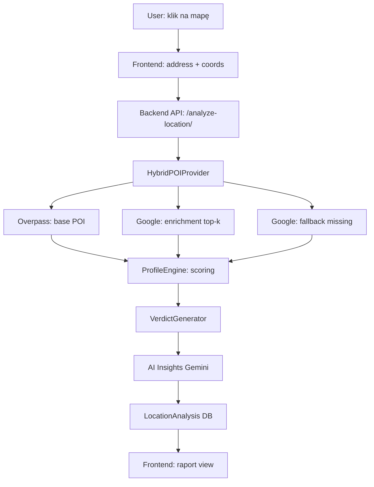

# 🌍 Loktis – Location Intelligence Platform

**loktis.pl** to narzędzie decyzyjne typu **location intelligence**, które odpowiada na pytanie:

> **„Czy ta lokalizacja jest dobra do życia lub inwestowania — dziś i w perspektywie 3–5 lat?"**

W przeciwieństwie do klasycznych portali nieruchomości:
- nie promujemy ogłoszeń,
- nie optymalizujemy pod kliknięcia,
- **wydajemy werdykt oparty na danych**.

Nie oceniamy mieszkania.  
**Oceniamy ryzyko i potencjał lokalizacji.**

---

## 📋 Spis treści

- [Aktualny stan projektu](#-aktualny-stan-projektu-mvp)
- [Funkcjonalności podstawowe](#funkcjonalności-podstawowe)
- [Funkcjonalności zaawansowane](#funkcjonalności-zaawansowane)
- [Architektura techniczna](#-architektura-techniczna)
- [Planowane rozszerzenia](#-planowane-rozszerzenia-high-impact)
- [Koszty operacyjne](#-koszty-operacyjne)
- [Monetyzacja](#-monetyzacja)

---

## ✅ Aktualny stan projektu (MVP)

**Status:** 🟢 **GOTOWY DO BETA-TESTÓW**

Platforma Loktis posiada pełną funkcjonalność core MVP:
- ✅ Analiza location-first (bez zależności od ogłoszeń)
- ✅ Scoring z AI decision insights
- ✅ System profili użytkownika
- ✅ Werdykt decyzyjny z logiką konsystencji
- ✅ Frontend Vue 3 z live progress
- ✅ Backend Django 5.2 + PostgreSQL
- ✅ Hybrid POI provider (Overpass + Google enrichment)

---

## Funkcjonalności podstawowe

### 1. Location-First Analysis
**Status:** ✅ ZAIMPLEMENTOWANE  
**Impact:** 🔥🔥🔥 KRYTYCZNY

**Opis:**
- Klik na mapie → cena / metraż → raport
- Flow w pełni *location-first* (bez zależności od ogłoszeń)
- Streaming NDJSON (real-time feedback użytkownikowi)
- Możliwość analizy dowolnego punktu na mapie

**Wartość biznesowa:**  
To fundament projektu i główna przewaga nad portalami nieruchomości.

---

### 2. Advanced Location Scoring (POI Intelligence)
**Status:** ✅ ZAIMPLEMENTOWANE  
**Impact:** 🔥🔥 BARDZO WYSOKI

**Technologia:**
- **Hybrid POI Provider** - 3-warstwowa strategia pobierania danych:
  1. **Overpass API** (OpenStreetMap) - pełne pokrycie bazowe (0 zł/miesięcznie)
  2. **Google Places Enrichment** - rating/opinie dla Top-3 POI per kategoria
  3. **Google Places Fallback** - uzupełnienie brakujących kategorii

**Scoring:**
- Analiza POI w promieniu 500–1000m (dostosowane per kategoria)
- 8 kategorii z dynamicznymi wagami:

| Kategoria | Status | Waga (Family) | Waga (Urban) | Uwagi |
|-----------|--------|---------------|--------------|-------|
| Sklepy | ✅ | 15% | 10% | Codzienne zakupy |
| Transport | ✅ | 20% | 25% | Kluczowe dla mobilności |
| Edukacja | ✅ | 25% | 5% | Krytyczne dla rodzin |
| Zdrowie | ✅ | 10% | 10% | Niedoszacowane przez rynek |
| Zieleń | ✅ | 15% | 10% | Silny argument sprzedażowy |
| Sport/rekreacja | ✅ | 10% | 10% | Uzupełniające |
| Gastronomia | ✅ | 5% | 20% | City-life indicator |
| Finanse | ✅ | 5% | 5% | Najmniej istotne |

**Cache:**
- Overpass: 24h TTL
- Google Places: 7 dni TTL (optymalizacja kosztów)

---

### 3. Quiet Score 2.0 (Noise Intelligence)
**Status:** ✅ ZAIMPLEMENTOWANE  
**Impact:** 🔥🔥 BARDZO WYSOKI

**Analiza źródeł hałasu:**
- Drogi szybkiego ruchu (< 200m)
- Arterie miejskie (> 30k pojazdów/dobę)
- Tramwaje i kolej (< 150m)
- Przystanki komunikacji (< 100m)
- Życie nocne (bary, kluby < 100m)

**Output:** skala 0–100  
**Wartość:** Jeden z najmocniejszych wyróżników produktu w Polsce.

**Kara za hałas:**
- Maximum -20 punktów do total score
- Progresywne penalizowanie (bliskość × intensywność)

---

### 4. System profili użytkownika (Personas)
**Status:** ✅ ZAIMPLEMENTOWANE  
**Impact:** 🔥🔥🔥 KRYTYCZNY

**Dostępne profile:**

#### 👨‍👩‍👧 Family (Rodzina z dziećmi)
- **Priorytety:** edukacja (25%), cisza (15%), zieleń (15%)
- **Critical caps:** car_access (min 35/100 → max 70 total)
- **Dealbreakers:** szkoły > 1km, hałas > 70/100

#### 🏙️ Urban (Singiel / Para miejska)
- **Priorytety:** transport (25%), gastronomia (20%), rozrywka (15%)
- **Critical caps:** brak
- **Dealbreakers:** transport > 800m

#### 📈 Investor (Inwestor)
- **Priorytety:** transport (30%), ROI potencjał (25%)
- **Critical caps:** brak
- **Dealbreakers:** brak transportu

#### 🚗 Car-First (Zmotoryzowani)
- **Priorytety:** car_access (30%), cisza (20%)
- **Critical caps:** car_access (min 70/100)
- **Dealbreakers:** brak dostępu samochodowego

**Funkcjonalności:**
- Dynamiczne wagi kategorii per profil
- System "critical caps" (must-have requirements)
- Wykrywanie specyficznych dealbreakers
- Personalizowane wyjaśnienia w raporcie

---

### 5. Werdykt decyzyjny (Decision Verdict)
**Status:** ✅ ZAIMPLEMENTOWANE  
**Impact:** 🔥🔥🔥 KRYTYCZNY

**Jednoznaczna rekomendacja oparta na danych:**
- ✅ **Polecane** (Score ≥ 70, wszystkie critical caps spełnione)
- ⚠️ **Warunkowo polecane** (Score 45-69 LUB critical cap niespełniony)
- ❌ **Niepolecane** (Score < 45 lub dealbreaker)

**Zawiera:**
- **Confidence Score** - stopień spełnienia kluczowych kryteriów profilu
- **Wyjaśnienie dynamiczne** - przy caps: "Ograniczona przez niespełnione wymagania: Dostęp samochodem"
- **Kluczowe czynniki** - automatycznie dobrane strengths/weaknesses
- **Kontekstowe uzasadnienie**

**Logika konsystencji (wdrożona 2026-02-08):**
```python
# CRITICAL: Jeśli critical cap niespełniony → downgrade verdict
if critical_caps_applied and verdict == RECOMMENDED:
    verdict = CONDITIONAL
    confidence -= 15 * len(critical_caps)  # Penalty
```

---

### 6. AI Decision Insights (Gemini 2.0)
**Status:** ✅ ZAIMPLEMENTOWANE  
**Impact:** 🔥🔥 BARDZO WYSOKI

**Technologia:**
- Model: **Gemini 2.0 Flash** (Google AI)
- Koszt: ~0 zł/miesiąc (free tier covers MVP traffic)

**Output:**
- **Summary** - 2-3 zdania opisujące konsekwencje i trade-offy
- **Attention Points** - max 3 punkty "Na co zwrócić uwagę"

**Przykład:**
```
Summary: "Ta lokalizacja dobrze pasuje do profilu Family, 
ale wymaga akceptacji ograniczonego dostępu samochodowego. 
Dzielnica oferuje świetną infrastrukturę edukacyjną i zieleń."

⚠ Dojazd autem może być utrudniony – weryfikacja w terenie
⚠ Brak parków w zasięgu spaceru – wyjazdy na weekendy
```

**Filosofia:** Decision-first (patrz: `PRODUCT_PRINCIPLES.md`)
- ❌ Nie sugerujemy poprawy wyniku
- ❌ Nie mówimy "zmień profil"
- ✅ Opisujemy konsekwencje i ryzyka
- ✅ Pomagamy podjąć świadomą decyzję

---

### 7. TL;DR Decision Generator
**Status:** ✅ ZAIMPLEMENTOWANE  
**Impact:** 🔥 WYSOKI

**Zawiera:**
- 3 największe **plusy** (AI-generated lub rule-based)
- 3 największe **minusy**
- Cena za m² vs średnia dla obszaru
- Infrastruktura score
- Quiet Score

**User experience:**
- Widoczne w pierwszych 3 sekundach po załadowaniu raportu
- Skrót umożliwiający szybką eliminację lokalizacji

---

### 8. Frontend (Vue 3 + TypeScript)
**Status:** ✅ ZAIMPLEMENTOWANE  

**Funkcjonalności:**
- **Location picker** (Leaflet + OpenStreetMap)
- **Live progress** analizy (streaming NDJSON)
- **Widok raportu**:
  - Verdict card z emoji i confidence
  - AI narrative summary
  - Category breakdown (radar chart)
  - Preferences impact (top contributors / limiting factors)
  - Map views (POI clusters)
- **Historia analiz** (localStorage)
- **Selektor profilu** - 4 persony + custom preferences
- **Responsive design** - mobile-first

**Stack:**
- Vue 3 (Composition API)
- TypeScript
- PrimeVue (UI components)
- Leaflet (mapy)
- Chart.js (wykresy)

Frontend wystarczający do sprzedaży MVP i beta-testów.

---

### 9. Backend (Django 5.2)
**Status:** ✅ ZAIMPLEMENTOWANE  

**Architektura:**
```
location_analysis/
├── models.py          # LocationAnalysis (public_id)
├── services.py        # AnalysisService (orchestration)
├── ai_insights.py     # Gemini AI integration
├── scoring/
│   ├── profile_engine.py      # Profile-based scoring
│   ├── profile_verdict.py     # Verdict generation
│   ├── profiles.py            # Profile configs
│   └── quiet_score.py         # Noise analysis
└── geo/
    ├── hybrid_poi_provider.py # 3-layer POI strategy
    ├── google_places_client.py
    ├── overpass_client.py
    └── nature_metrics.py
```

**Kluczowe elementy:**
- Model `LocationAnalysis` z `public_id` (UUID)
- Cache TTL (Overpass 24h, Google 7 dni)
- Rate limiting
- Architektura Services / Providers
- **88 testów** (coverage: backend core logic)

**Performance:**
- Średni czas analizy: **8-12 sekund**
- Streaming progress: 6 statusów (fetch → POI → scoring → AI → verdict → save)

---

## 🏗 Architektura techniczna

### Stack technologiczny

**Backend:**
- Django 5.2 + Django REST Framework
- PostgreSQL (Railway)
- Python 3.11+
- Google Generative AI (Gemini 2.0)

**Frontend:**
- Vue 3 (Composition API) + TypeScript
- Vite (build tool)
- PrimeVue (component library)
- Leaflet (mapping)

**External APIs:**
- Overpass API (OpenStreetMap) - FREE
- Google Places API (enrichment + fallback) - ~$0.50/raport
- Gemini AI (decision insights) - FREE tier

**Deployment:**
- Backend: Railway (PostgreSQL + Python app)
- Frontend: Netlify / Vercel (planned)

---

### Przepływ danych (analiza lokalizacji)



---

## 🚧 Planowane rozszerzenia (High Impact)

### 10. Custom Scoring (suwaki wag)
**Status:** ❌ BRAK  
**Ciężkość:** 🟡 Średnia  
**Impact:** 🔥 WYSOKI

- Suwaki wag kategorii dla zaawansowanych użytkowników
- Przeliczanie score bez ponownego zapytania do API
- Poczucie pełnej kontroli (UX boost)

**Implementacja:**
- Frontend: slider components per kategoria
- Backend: endpoint `/recalculate-score/` z wagami custom

---

### 11. Ukryte ryzyka lokalizacji
**Status:** ❌ BRAK  
**Ciężkość:** 🟡 Średnia  
**Impact:** 🔥🔥 BARDZO WYSOKI

**Źródła danych publicznych:**
- Strefy hałasu (mapy akustyczne UE)
- Planowane drogi / linie kolejowe (GDDKiA)
- Lotniska w promieniu 10 km
- Strefy zalewowe (ISOK)
- Plany zagospodarowania przestrzennego

**Wartość:**
- To informacje, których nie widać podczas 15-minutowego spaceru
- Kluczowe dla długoterminowej decyzji inwestycyjnej

---

### 12. Jakość życia w czasie (perspektywa 3-5 lat)
**Status:** ❌ BRAK  
**Ciężkość:** 🟡 Średnia  
**Impact:** 🔥 WYSOKI

**Źródła:** GUS, dane gmin

- Trendy demograficzne mikro (starzenie vs napływ rodzin)
- Charakter dzielnicy (tranzytowa vs osiadła)
- Przewidywana zmiana charakteru (gentryfikacja)

---

### 13. Edukacja - obłożenie szkół
**Status:** ❌ BRAK  
**Ciężkość:** 🟡 Średnia  
**Impact:** 🔥 WYSOKI (dla Family profile)

**Źródła:** dane gmin / Ministerstwo Edukacji

- Obłożenie szkół i przedszkoli
- Ryzyko braku miejsc w placówkach
- Trendy (rosnąca vs malejąca liczba dzieci w rejonie)

---

### 14. Środowisko i zdrowie
**Status:** ❌ BRAK  
**Ciężkość:** 🟢 Niska (API publiczne)  
**Impact:** 🔥 WYSOKI

**Źródła:** GIOŚ (Główny Inspektorat Ochrony Środowiska)

- Historyczna jakość powietrza (PM2.5 / PM10)
- Sezonowość smogu
- Strefy przekroczeń norm

---

### 15. Nasłonecznienie i ekspozycja
**Status:** ❌ BRAK  
**Ciężkość:**  
- 🟢 Prosta heurystyka (kierunek świata + wysokość zabudowy)
- 🔴 Zaawansowana analiza cieni (wymaga 3D models)

**Wartość:** Silnie wpływa na komfort życia (depresja sezonowa).

---

## 💰 Koszty operacyjne

### 1. Google Maps Platform
**Główny koszt zmiennny:**

- **Place Details** (enrichment): ~$0.40/raport (20-30 POI)
- **Nearby Search** (fallback): ~$0.10/raport (warunkowe)
- **Geocoding**: $0.005/raport

**Optymalizacja:**
- Cache: 7 dni (POI), 24h (Overpass)
- Free tier: $200 kredytu/miesiąc
- **Break-even:** ~400 raportów/miesiąc w ramach free tier

### 2. Gemini AI
- Model: Gemini 2.0 Flash
- Koszt: **~0 zł** (free tier pokrywa MVP traffic)
- Na wysokim wolumenie: $0.001/raport

### 3. Infrastruktura (Railway)
- PostgreSQL: ~$5/miesiąc
- Backend (Python): ~$5/miesiąc
- **Razem:** ~$10/miesiąc (fixed cost)

### Podsumowanie kosztów:
- **Fixed:** $10/miesiąc
- **Variable:** ~$0.50/raport (przy < 400 raportów/mc = $0)
- **Marginal profit na raport (9 PLN):** ~$1.80 (8 PLN)

---

## 💵 Monetyzacja

**Strategia:**
- **1 darmowy raport** (bez szczegółów cenowych)
- **Kolejne raporty:** 9–19 PLN / raport
- **Pakiety:**
  - 5 raportów: 39 PLN (20% taniej)
  - 10 raportów: 69 PLN (30% taniej)

**Płatności:**
- Przelewy24 (BLIK, karty, przelewy)
- Stripe (międzynarodowi użytkownicy - future)

**Pozycjonowanie:**
- Raport jako **produkt decyzyjny**, nie SaaS
- Wartość: oszczędność czasu (20h research) + uniknięcie błędnej decyzji (200k+ PLN)

---

## 🎯 Priorytety wdrożeniowe (2026 Q1-Q2)

1. ✅ ~~Werdykt decyzyjny~~ (Zrobione)
2. ✅ ~~Profile użytkownika~~ (Zrobione)
3. ✅ ~~AI decision insights~~ (Zrobione)
4. ✅ ~~Verdict consistency fixes~~ (Zrobione)
5. 🚧 **Ukryte ryzyka lokalizacji** (W trakcie planowania)
6. 🚧 **Custom scoring (suwaki wag)** (UX enhancement)
7. 🔜 **Konta użytkowników** (dopiero po PMF)
8. 🔜 **System płatności** (Przelewy24 integration)

---

## 📚 Dokumentacja techniczna

- `/PRODUCT_PRINCIPLES.md` - Filozofia produktu i zasady raportów
- `/backend/README.md` - Backend setup i API docs (TODO)
- `/frontend/README.md` - Frontend setup i komponenty (TODO)

---

## 🚀 Quick Start (Development)

### Backend setup
```bash
cd backend
python -m venv venv
venv\Scripts\activate  # Windows
source venv/bin/activate  # Linux/Mac
pip install -r requirements.txt
python manage.py migrate
python manage.py runserver
```

### Frontend setup
```bash
cd frontend
npm install
npm run dev
```

**Environment variables:**
- `GEMINI_API_KEY` - Google AI API key
- `GOOGLE_PLACES_API_KEY` - Google Maps Platform key
- `DATABASE_URL` - PostgreSQL connection string (Railway)

---

> **„Ten raport ma wskazać ryzyka, których nie widać podczas 15-minutowego spaceru po okolicy."**

**Kontakt:** [loktis.pl](https://loktis.pl)
